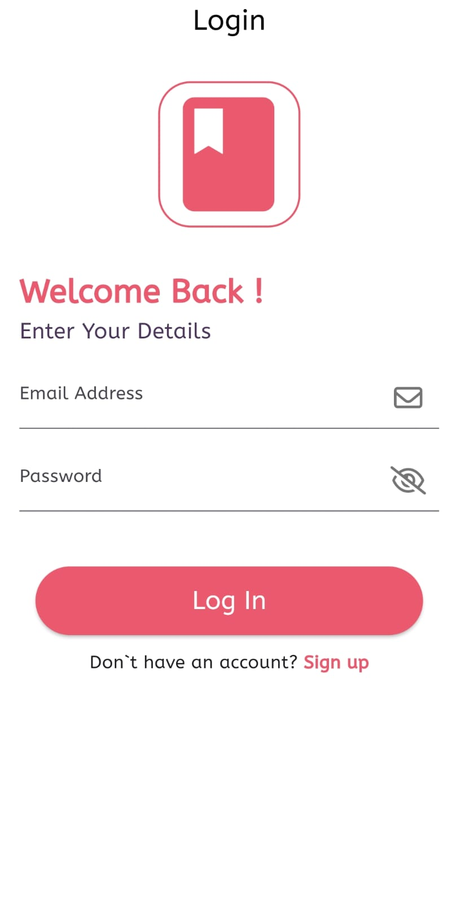
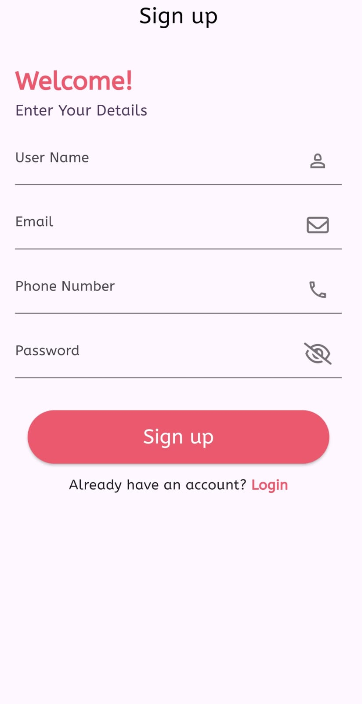
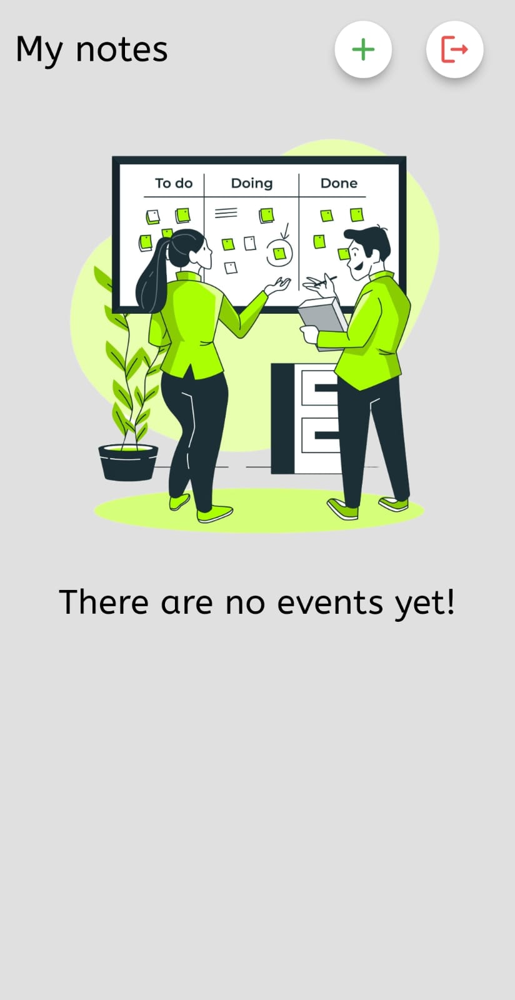
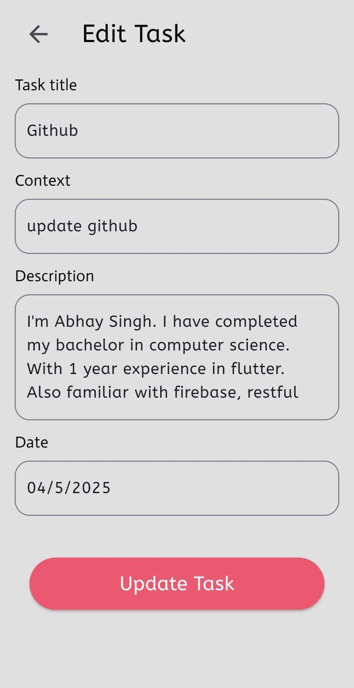
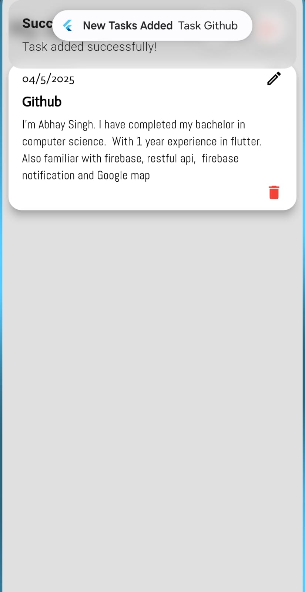
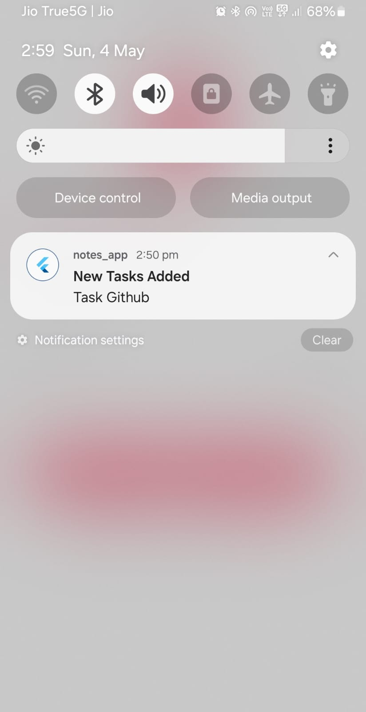

# ✅ Flutter Task Management App UI

A clean, modern Flutter-based Task Management app UI that helps users stay organized by creating, editing, and tracking tasks. Now integrated with **Firebase Authentication**, **Cloud Storage**, and **Push Notifications** for a real-world production-ready experience.

---

## 📱 Screenshots

| Login                             | Signup                              | Home                            |
|-----------------------------------|-------------------------------------|---------------------------------|
|  |  |  |

| Add Task                               | Edit Task                       | Task Added                                 |
|----------------------------------------|---------------------------------|--------------------------------------------|
|  |  |  | 

| Notifications                                    |
|--------------------------------------------------|
|  |  |

---

## ✨ Features

- 🔐 Firebase Authentication (Signup / Login / Logout)
- ☁️ Firebase Cloud Storage for file uploads (e.g., task attachments)
- 🔔 Firebase Cloud Messaging (Push Notifications)
- 🏠 Home screen showing task list
- ➕ Add new tasks with validation
- ✏️ Edit and update existing tasks
- ✅ Confirmation UI when task is added
- 📆 Date & Time Picker for task deadlines
- 🎯 Fully responsive & minimalistic UI
- 🚀 State management using GetX

---

## 📦 Packages Used

| Package                       | Purpose                      |
|-------------------------------|------------------------------|
| `firebase_core`               | Firebase core initialization |
| `firebase_auth`               | User authentication          |
| `cloud_firestore`             | Task storage and syncing     |
| `firebase_storage`            | File/image upload            |
| `firebase_messaging`          | Push notification support    |
| `flutter_local_notifications` | Local notification display   |
| `getx`                        | State management & routing   |
| `google_fonts`                | Custom fonts                 |
| `intl`                        | Date formatting              |

---

## 🛠️ Firebase Setup Instructions

1. **Enable Services:**
    - **Authentication:** Email/Password
    - **Firestore Database**
    - **Storage**
    - **Cloud Messaging**

2. **Download `google-services.json`** and place it inside:
